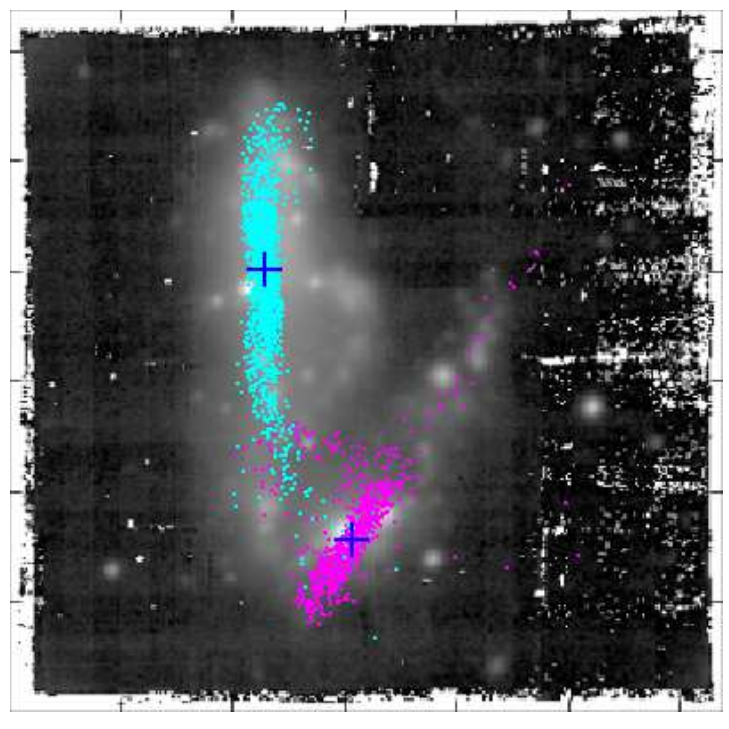

# Introduction {#sec:intro}

Manuscript preparation is an integral part of disseminating research.
Currently papers are predominantly prepared in \LaTeX\ or WYSIWYG^["What you see is what you get"] editors such as Microsoft Word or Apple Pages.
While powerful in their own ways, each of these have their own drawbacks.
\LaTeX\ often suffers from a steep learning curve and cryptic error messages.
On the other hand, WYSIWYG editors have historically had sub-par mathematics rendering ability and suffered from difficulties with robust internal referencing.
A secondary consideration is that output to other formats (e.g., HTML, EPUB) can be tedious and/or require a significant investment in tooling.
This latter effect potentially harms dissemination of scientific results.

Here I describe and demonstrate a method of preparing manuscripts by writing them in Markdown ([Section @sec:markdown]) and using `pandoc` ([Section @sec:pandoc]) to convert the Markdown file into a format suitable for submission to journals (e.g., \TeX\ or `.docx`).
This approach simplifies the writing process while retaining the power of \LaTeX's formulae and making internal references easy.
In [Section @sec:prep] I summarize the specification of title information as well as inclusion of images, tables and equations.
In [Section @sec:notes] I describe the practical aspects of preparing papers in Markdown, including the use of templates, document filters, and internal document referencing.

## Markdown {#sec:markdown}

Markdown is a markup format that was originally intended to specify a plain text format which could be converted to HTML, with the motivation that:

> A Markdown-formatted document should be publishable as-is, as plain text, without looking like it’s been marked up with tags or formatting instructions. – John Gruber

The Markdown specification was released by John Gruber in 2004^[<https://daringfireball.net/projects/markdown/>].
Since then Markdown and its variants have become widely used.
It aspires to "get out of the way and let people write" by utilizing minimally intrusive text formatting notation.
While describing Markdown is beyond this scope of this document, [Table @tbl:mu_emphasis] shows a brief comparison of how one might specify emphasized text in a few different markup formats.

Markup Language     Notation
----------------    -------------------------
\LaTeX              `\emph{emphasize this}`
HTML                `<em>emphasize this</em>`
Markdown            `_emphasize this_`

Table: Emphasizing text in several markup specifications. {#tbl:mu_emphasis}

In this example, Markdown's emphasis method is less visually intrusive than that of \TeX\ or HTML, making it easier to read the text of the source document.
For the remainder of the document I assume the reader is familiar with syntax of Markdown.
This set of templates specifically utilizes the `pandoc` Markdown flavor^[<https://pandoc.org/MANUAL.html#pandocs-markdown>] which has some differences and extensions compared to Gruber's original specification.

## Pandoc {#sec:pandoc}

`pandoc`^[<https://pandoc.org>] is "a universal document converter", originally written by John MacFarlane.
It currently supports 25 input formats and 47 output formats (including variations of standards).
Additional formats can be supported by providing user-defined writers, written in the lua language.
`pandoc` is written in the Haskell programming language and supports extensions written as filters.
`pandoc` works by taking one or more input files and applying document templates to generate outputs in a different format.
Default templates are supplied with `pandoc`, but here I will demonstrate the use of a custom template to create \aastex\-compatible output.
During the document conversion `pandoc` can use additional metadata specific in a YAML ("YAML Ain't Markup Language") header.
This header can either be prepended to the Markdown text or incorporated from a separate file.

In order to convert Markdown source into a \TeX\ file which is compatible with journal submission requirements I have created a set of templates which instruct `pandoc` in how to generate the output.
Note that the author can write \TeX\ directly into the Markdown file and `pandoc` will happily pass it through to the finished product.
However, this may compromise alternate (non-\TeX) output formats.
For example, the \aastex\ `deluxetable` environment can be used, but it will not be rendered as a table in non-\TeX\ formats and will instead be displayed as the raw \TeX\ source (or worse).
`pandoc` filters^[<https://pandoc.org/filters.html>] can be crafted to convert simple `pandoc` tables into `deluxetable`s on the fly, if desired.

## Paper Organization

I broadly divide this article into demonstrations of how to prepare a manuscript in Markdown such that it generates nearly submittable \TeX\ ([Section @sec:prep]).
This includes how to specify the article style via the YAML header of the Markdown file ([Section @sec:style]).
I then demonstrate how to include images ([Section @sec:images]), tables ([Section @sec:tables]), and citations ([Section @sec:citations]).
I conclude by discussing some practical considerations for writing journal articles in Markdown ([Section @sec:notes]).
Throughout I assume the reader is familiar with Markdown and do not discuss Markdown's text formatting.
Instead I discuss the general behavior of the template file and actions which are necessary for generating \aastex-compatible output.

The Markdown file, `pandoc` invocation, and associated filters used to create the \TeX\ for this document are available at: <https://github.com/privong/papers-in-markdown>.
The text of this document is in the `aastex63/demo.md` file.
This approach can be extended to the templates of other journals by modifying the YAML header in the Markdown file and the \TeX\ template file.
Bare-bones examples for MNRAS and A\&A are provided in the same github repository.

# Manuscript Preparation in Markdown {#sec:prep}


## Manuscript Metadata and Styles {#sec:style}

The Markdown file can be prefixed with a header in the YAML format.
Article data such as the title, relevant dates, author list, keywords, etc. is specified here.
This header information is extracted via a \TeX\ template file and passed through to the desired output file.
The `pandoc` template also derives the \aastex\ style information from this YAML header, via the `aastexopts` entry.
Document authors can include additional \TeX\ packages by specifying them in the header as `texpackages` entries, as shown below.
This YAML header is similar to that used in preparing this document:

```{#yamlheader .numberLines caption="YAML Header Example"}
---
aastexopts: [singlecolumn]
preambleinput: ["macros.tex"]
texpackages:
- name: xspace
#  opts:
- name: amsmath
#  opts:
bibstyle: aasjournal
bibliography: demo.bib
received: "January 1, 2018"
#revised: "January 7, 2018"
#accepted: "\\today"
#submitjournal: ApJ
title: "Preparation of Articles using Markdown and Pandoc"
shorttitle: "Articles in Markdown and Pandoc"
shortauthors: Privon
author:
- name: George C. Privon
  ORCID: 0000-0003-3474-1125
  affiliation: ["Department of Astronomy, University of Florida, 211 Bryant Space Sciences Center, \
Gainesville, 32611 FL, USA"]
#  nocollaboration: 1
#- name: Josiah Carberry
#  ORCID: 0000-0002-1825-0097
#  affiliation: ["Wesleyan University, Middletown, CT", "Brown University: Providence, RI"]
#  collaboration: "(ORCID Demonstration)"
keywords: [miscellaneous]
software: ["[`pandoc`](http://pandoc.org)"]
facility: []
abstract: |
  A short abstract.
---
```

Unwanted header entries can be commented out with a `#` or safely deleted (here they have been commented so they appear for reference purposes).
If a different style (e.g., `twocolumn`) is desired, this can be changed in `aastexopts`, and these options will be passed through to the \TeX\.
YAML header entries and corresponding \TeX\ template code have been created to correspond to most (if not all) of the \aastex\ metadata options.

Entries in this YAML header are made available to the `pandoc` processing steps and conditional statements in the applied document template(s).
As a short example, this code in the `aastex63/aastex63_template.tex` file processes the r`eceived`/`revised`/`accepted` YAML entries and inserts them into the resulting \LaTeX\ output:

```
$if(received)$
\received{$received$}
$endif$

$if(revised)$
\revised{$revised$}
$endif$

$if(accepted)$
\accepted{$accepted$}
$endif$
```

Similar code is used to process the author list, titles, etc.

## Images {#sec:images}

Images can be included, captioned, and labeled.
A demonstration is [Figure @fig:dm1647], which was included via the Markdown:

```
{#fig:dm1647 width=3in height=3in}
```

{#fig:dm1647 width=3in height=3in}

## Tables {#sec:tables}

Markdown has its own table formats, which `pandoc` will convert into \TeX\.
[Table @tbl:storms] is an example of a `pandoc` Markdown "simple table".

Date        Day              Number of storms
----------  --------------  -----------------
2018-05-21  Monday                        ...
2018-05-22  Tuesday                         2
2018-05-23  Wednesday                       1
2018-05-24  Thursday                        3
2018-05-25  Friday                          0
2018-05-26  Saturday                        0
2018-05-27  Sunday                          0

Table: Number of imaginary thunderstorms in Gainesville, FL during the 21st week of 2018. {#tbl:storms}

This table was created with:

```
Date        Day              Number of storms
----------  --------------  -----------------
2018-05-21  Monday                        ...
2018-05-22  Tuesday                         2
2018-05-23  Wednesday                       1
2018-05-24  Thursday                        3
2018-05-25  Friday                          0
2018-05-26  Saturday                        0
2018-05-27  Sunday                          0

Table: Number of imaginary thunderstorms in Gainesville, FL during the 21st week of 2018. {#tbl:storms}
```

`pandco` will pass \LaTeX\ tables through the chosen \LaTeX\ parser.
Thus, tables listings in the Markdown file (e.g., \aastex\ `deluxetable`) will be appropriately rendered when producing PDFs.
However, such \TeX\ tables will not be converted from \TeX\ to other output formats when embedded in a Markdown file.
So the benefits of directly including \TeX\ tables in the Markdown file must be weighted against the desred flexibility in output formats.

## Citations {#sec:citations}

Citations can be incorporated using the `citeproc` filter.
These citations take the form of: `[@Astropy2018]`, which corresponds to to: [@Astropy2018] or `@Astropy2018` to cite in the format of: @Astropy2018.
By default, `citeproc` will convert the references into text when generating \TeX\ or PDF files, in a format specified by the user via a Citation Style Language^[<https://citationstyles.org/>] definition.
Presently most of the main astrophysics journals lack entries in the CSL database.
In order to create journal-compatible submission files the Markdown file must be explicitly converted to \TeX\ prior to compilation to PDF.

To convert the citations to `\cite{}` style commands (which are likely preferred for journal submissions) call `pandoc` with the `--natbib` or option.
The resulting \TeX\ file can then be processed with `latex`^[or your favorite \TeX\ engine.] and `bibtex` in order to obtain references which are formatted to the journal's specifications.
The journal's `.bst` file can be specified in the YAML header and this information is propagated through to the \TeX\ source.
A sample workflow for this is provided in the `aastex63/README.md` file in the github repository.

## Equations {#sec:equations}

Equations can be specified in the text using standard \TeX\ macros.
For example, entering: `$$e^{i\pi} + 1 = 0$$ {#eq:euler}` results in this output:

$$e^{i\pi} + 1 = 0$$ {#eq:euler}

This method of specifying math and equations can be coupled with `pandoc`'s support for a variety of methods to render math in many other output formats including HTML^[<https://pandoc.org/MANUAL.html#math-rendering-in-html>].
The bracketed expression at the end creates an in-text reference, similar to the `\label{}` command in \LaTeX.
With such a label, [Equation @eq:euler] can also subsequently be referenced in the text by writing `[Equation @eq:euler]`.

# Notes on Preparation for Submission {#sec:notes}

With a Markdown file now containing the text of the manuscript, some short additional steps must be taken to transform that Markdown source into a format suitable for submission to a journal.
This includes applying an appropriate \TeX\ template ([Section @sec:templates]), scripted modification of documents on the fly ([Section @sec:filters]), and some minor clean-up of the resulting \TeX\ source ([Section @sec:texclean]).
The latter two steps are essentially optional, though document filtering may be helpful to facilitate dissemination of the manuscript in additional formats beyond the journal's PDF format.

## Available Templates {#sec:templates}

I have created templates and demonstration files for the AAS Journals, Monthly Notices of the Royal Astronomical Society, and Astronomy & Astrophysics.
The AAS Journals example (which you are reading now) is the most detailed, while the others are bare-bones and intended to constitute a minimal starting point.
However, the Markdown used to generate this article should work in the demonstration files for the other journals.

The templates are different because each journal has different options and handling of author lists, abstracts, and metadata.
For example collaboration information can be provided to AAS Journals, but not to MNRAS or A&A.
Hence it makes some sense to keep the Markdown templates separate for these journals.
However, if a manuscript is prepared using the Markdown template for A&A but the authors later decide to submit to MNRAS, the only major changes needed will be to the YAML header in the Markdown file.

## Document Filters {#sec:filters}

`pandoc` supports user-written filters.
These filters enable customized processing of documents during conversion.
One example of desirable filter processing is to convert tables formatted in Markdown into \aastex\ `delxuetables`.
Use of such a filter would make it easier to convert the Markdown source to other formats (e.g., HTML, ePUB) without needing to rewrite a \TeX\ table.

Simple filters are straightforward to construct and I demonstrate one here.
With output formats besides \aastex\ in mind, the acknowledgments portion of the document has been delineated in the Markdown file as a macro: `{{acknowledgments}}`.
However it is desirable to automatically convert this to the \TeX\ source appropriate for the journal's template.
For \aastex\, this is the `\acknowledgments{}` macro.
The following filter, written in lua, performs this translation when included as part of the `pandoc` invocation:

```{#ackfilter .numberLines caption="lua filter code for acknowledgements replacement"}
return {
  {
    Str = function (elem)
      if elem.text == "{{acknowledgments}}" then
        if string.find(FORMAT, "latex") then
          return pandoc.RawInline("tex", "\\acknowledgements")
        else
          return elem
        end
      end
    end,
  }
}
```

This filter can be expanded to handle other output formats by adding additional `elseif` clauses for other `FORMAT` types.
A variant of this filter with an additional handling for HTML documents is included as `aastex63/filters/acknowledgments.lua` in the template distribution.
Similar filters are included for the MNRAS and A&A templates, whose style files handle acknowledgements in a different way.
These filters are included in the processing chain by adding the `--lua-filter=` command-line argument to `pandoc`.
Commonly used languages for writing `pandoc` filters include Haskell, lua, and python^[Using either the `panflute` or `pandocfilters` modules.].
Note that a lua parser is included with `pandoc` versions 2.0 and newer, and the use of lua filters is faster than other options.

## Internal References

Naively `pandoc` does not support internal reference to figures or equations and does not support numbered section references.
However the `pandoc-crossref` filter adds support for this (and has been used in the preparation of this document).
`pandoc-crossref` uses the same syntax as `citeproc`, so adds little cognitive overhead in inter-document referencing.
However to avoid `citeproc` incorrectly processing internal references, `pandoc-crossref` must be invoked first.

## \TeX\ Clean up {#sec:texclean}

A small amount of clean \TeX\ source cleanup may be necessary after running the Markdown through `pandoc`.
The YAML header elements are incorporated into the manuscript using `for` loops, which may leave trailing punctuation in lists (e.g., a trailing em dash following the list of keywords).
These will show up in the final output source unless they are removed at the intermediate stage between \TeX\ generation and PDF compilation.

# Summary

I have provided a brief demonstration for a method of writing research articles in Markdown and converting them to an \aastex-compatible format for submission to AAS Journals.
The accompanying template and source code release also includes templates for MNRAS and A&A.
The advantage of this approach is improved readability of the source files and added flexibility in output formats.
The latter makes it easier for authors to share HTML and/or EPUB versions of manuscripts, potentially improving dissemination of results.

I emphasize that this `pandoc` approach does not supplant the journal-provided \LaTeX\ templates, but instead complements it by providing easier access to additional output formats.
This approach is also flexible and does not lock the author into a single format.
If at any point an author feels unable to progress in Markdown alone, \TeX\ can be embedded directly into the Markdown (though this potentially compromises the flexibility in well-formatted outputs besides \TeX\ or PDF).
Alternately, `pandoc` can be used to convert the Markdown to a \TeX\ file and the author can move to editing that \TeX\ file as if they had been writing in \TeX\ all along.

I have made the templates and demonstration text publicly available for use and modification by the community: <https://github.com/privong/papers-in-markdown>.
The code is licensed under the GPLv3 (or later) and the the documentation is licensed under a Creative Commons Attribution-ShareAlike 4.0 International License.
Comments, bug reports, and enhancements are welcome.

{{acknowledgments}}

I thank Kelly Hondula for comments on this manuscript and acknowledge support from the University of Florida.

{{end_acknowledgments}}

# References
